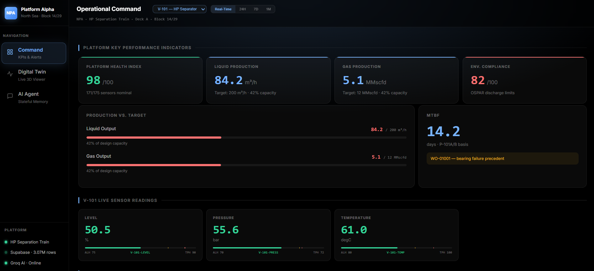
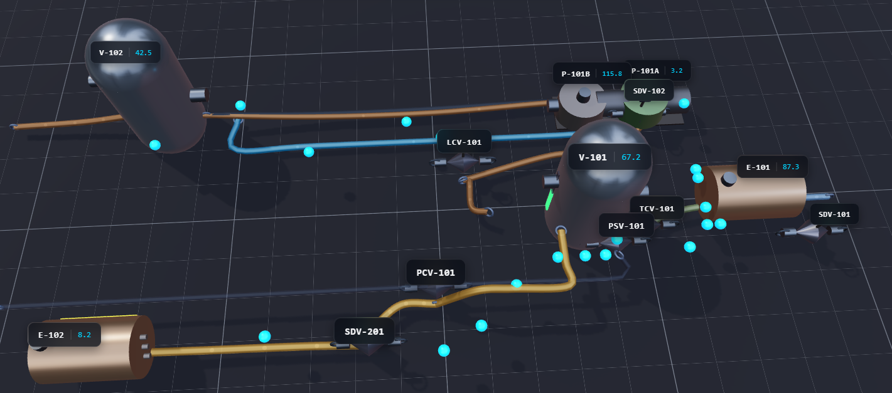
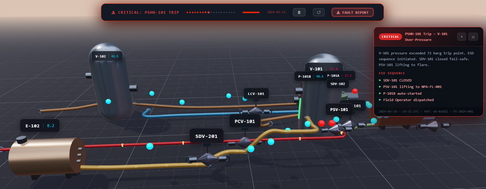
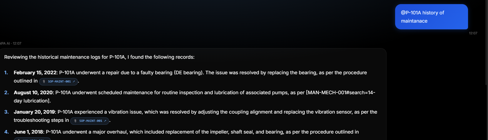

# NPA Digital Twin: High-Fidelity Remote Monitoring Dashboard with AI

# Team: Tokyo

## Team Members:
JayasuryaSakthivel

VishalLakshmiNarayanan

Amaan Mohamed Kalemullah

## Overview
The NPA (North Plant Area) Digital Twin is an industrial-grade remote monitoring and diagnostic platform designed for high-stakes oil and gas operations. It integrates real-time telemetry, 3D spatial context, and collaborative AI to bridge the gap between complex sensor data and actionable maintenance intelligence.

The application satisfies three primary tracks of operational excellence:
1. **Physical Domain Transparency**: Real-time 3D visualization and unified P&ID cross-referencing.
2. **Collaborative Intelligence**: Autonomous Voice-AI intervention (Vapi) and expert multi-modal chat assistants.
3. **Stateful Insight**: Persistent memory of historical failures, maintenance logs, and operational context.

## Visualizations

### Operational Command Dashboard
The primary interface provides high-level KPIs, production targets, and direct links to safety documentation.


### 3D Spatial Context
The digital twin environment allows operators to inspect asset health within their physical spatial configuration.


### Autonomous Fault Detection
Real-time simulation showing the system's response to an overpressure event (PSHH-101 Trip) and subsequent autonomous field manager outcall.


### Intelligent AI Operations Hub
A context-aware industrial assistant with persistent memory, real-time telemetry cross-referencing, and automated work order generation.


## Core Technical Features

### Physics-Informed 3D Visualization
*   Implemented using **Three.js** and **React Three Fiber**.
*   Real-time reflection of valve states (Open/Closed/Throttled).
*   Dynamic heatmaps and pressure gradient indicators.
*   Interactive raycasting for asset-level telemetry inspection.

### Autonomous Voice-AI Intervention (Track 2)
*   Integrated **Vapi.ai** for real-time outbound telephone calls to field personnel.
*   Autonomous briefing capabilities: The AI summarizes current fault data and proposes a specific Plan of Action (PoA) based on SOPs.
*   Stateful coordination: The AI remembers historical failure modes during the call.

### Context-Aware Intelligent Assistant
*   Powered by **Groq (Llama 3.3-70B)** for sub-second inference.
*   **Supermemory** integration for long-term conversational persistence.
*   Autonomous citation logic: Every claim is cross-referenced with PDF documentation (SOPs, Manuals, P&IDs) with direct highlight linking.

### Data Engineering & Infrastructure
*   **Supabase / PostgreSQL**: Scalable backend for sensor metadata and maintenance history.
*   **Timeseries Optimization**: Efficient handling of historical sensor replay data.
*   **Next.js 16**: High-performance frontend utilizing Server Components and Turbopack.

## Installation & Deployment

### Phase 1: Environment Configuration
Create a `.env.local` file in the root directory and populate it with the following keys:
```env
# Supabase
NEXT_PUBLIC_SUPABASE_URL=your_url
NEXT_PUBLIC_SUPABASE_ANON_KEY=your_key
SUPABASE_SERVICE_ROLE_KEY=your_key

# Intelligence Providers
GROQ_API_KEY=your_key
SUPERMEMORY_API_KEY=your_key

# Voice AI (Vapi)
VAPI_API_KEY=your_key
VAPI_PHONE_NUMBER_ID=your_key
```

### Phase 2: Dependency Installation
```bash
npm install
```

### Phase 3: Data Ingestion
Populate the database with historical telemetry and asset metadata:
```bash
npm run db:ingest
```

### Phase 4: Local Development
```bash
npm run dev
```

## Operational Safety & Compliance
*   **MAWP Guardrails**: The system enforces a Maximum Allowable Working Pressure (75 barg) across all UI elements and AI prompts.
*   **SOP Integration**: All AI-suggested recovery plans are mapped directly to SOP-MAINT-001 and SOP-SAFE-001.
*   **Transparency**: Digital signatures and source citations are mandatory for all autonomous alerts.

---
Developed for industrial reliability and operational auditability.
